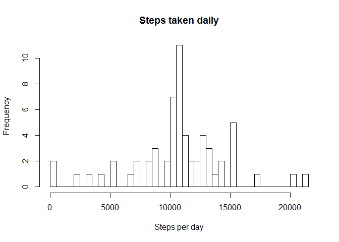

# Reproducible Research: Peer Assessment 1

```r
library(reshape2)
library(lattice)
Sys.setlocale("LC_ALL","English")
```

```
## [1] "LC_COLLATE=English_United States.1252;LC_CTYPE=English_United States.1252;LC_MONETARY=English_United States.1252;LC_NUMERIC=C;LC_TIME=English_United States.1252"
```


## Loading and preprocessing the data


```r
data<-read.csv("activity.csv",na.strings = "NA")
data$date<-as.Date(data$date,"%Y-%m-%d")
```


## What is mean total number of steps taken per day?

Calculate total number of steps and plot histogram


```r
melted<-melt(data,id.vars=c("date","interval"),measure.vars="steps")
dataTotal<-dcast(melted,date~variable,sum,na.rm=TRUE)
hist(dataTotal$steps,breaks = length(dataTotal$steps),main="Steps taken daily",xlab="Steps per day")
```

<!-- -->

Calculate mean and median number of steps


```r
dataMean<-mean(dataTotal$steps)
dataMedian<-median(dataTotal$steps)
```

Mean number of steps is 9354.2295082.
Median number of steps is 10395.

## What is the average daily activity pattern?

Calculate average number of steps on every 5-minute interval and make a plot


```r
dataDaily<-dcast(melted,interval~variable,mean,na.rm=TRUE)
plot(dataDaily$interval,dataDaily$steps,type="l",main="Average number of steps vs time interval",xlab="Time of a day",ylab="Average number of steps")
```

<!-- -->

Find interval containing maximum of average number of steps


```r
maxIntervalidx<-which.max(dataDaily$steps)
maxInterval<-dataDaily$interval[maxIntervalidx]
```

The 5-minute interval 835 on average contains maximum number of steps.

## Imputing missing values

Calculate total number of missing values in the dataset


```r
missingRowsidx<-!complete.cases(data)
missingRows<-sum(missingRowsidx)
```

Total number of rows with missing values is 2304.

To fill in missing data average number of steps for each 5-minute interval will be stored.


```r
dataNew<-data
for(i in 1:length(dataNew$steps)) {
  if(is.na(dataNew$steps[i])) {
    dataNew$steps[i]<-dataDaily$steps[which(dataNew$interval[i]==dataDaily$interval)]
  }
}
```

Calculate total number of steps and plot histogram


```r
meltedNew<-melt(dataNew,id.vars=c("date","interval"),measure.vars="steps")
dataTotalNew<-dcast(meltedNew,date~variable,sum,na.rm=TRUE)
hist(dataTotalNew$steps,breaks = length(dataTotalNew$steps),main="Steps taken daily",xlab="Steps per day")
```

<!-- -->

Calculate mean and median number of steps of the new data set


```r
dataMeanNew<-mean(dataTotalNew$steps)
dataMedianNew<-median(dataTotalNew$steps)
```

Mean number of steps is 1.0766189\times 10^{4}. Mean number of steps without imputing missing values is 9354.2295082.
Median number of steps is 1.0766189\times 10^{4}. Median number of steps without imputing missing values is 10395.

## Are there differences in activity patterns between weekdays and weekends?

Create a new two-level factor variable (weekday, weekend)


```r
weekend<-(weekdays(dataNew$date)=="Saturday"|weekdays(dataNew$date)=="Sunday")
dataNew$daytype<-factor(weekend,levels=c(FALSE,TRUE),labels=c("weekday","weekend"))
```

Rearrange the data as interval+daytype vs. mean number of steps


```r
meltedNew2<-melt(dataNew,id.vars=c("date","interval","daytype"),measure.vars="steps")
dataDailyWeek<-dcast(meltedNew2,interval+daytype~variable,mean)
```

Make a panel plot


```r
xyplot(dataDailyWeek$steps~dataDailyWeek$interval|dataDailyWeek$daytype,layout=c(1,2),type="l",xlab="Time of a day",ylab="Average number of steps")
```

<!-- -->

```r
# xyplot(dataDailyWeek$steps~dataDailyWeek$interval|dataDailyWeek$daytype)
```


